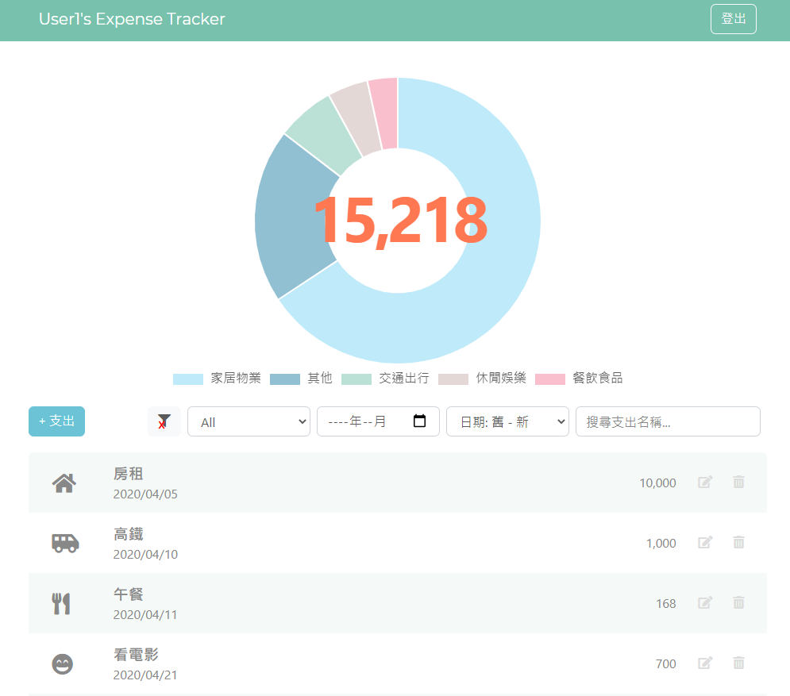

# Expense Tracker
A simple expense tracking web app to help you know your cash flow at ease.

https://frozen-taiga-94619.herokuapp.com

### Testing Account

**user1:**
* Email: user1@example.com
* Password: 12345678

**user2:**

* Email: user2@example.com

* Password: 12345678

  

## Features
* create account with email or facebook account to record expenses
* browse all expenses and check total amount
* create new expense
* edit existing expense
* delete expense
* filter, search, and sort expense simultaneously:
  * filter expenses by category, year and month simultaneously
  * search by expense name
  * sort by amount or date
* check subtotal amount of filtered results
* click X button to clear year and month filtering condition
* timezone differece issue is managed , and all date value is show in local time

## UX Features

* confirm before deleting expense record
* show error message when no results found
* hover over the category icon to see category name on tooltips

## Prerequisite
* bcryptjs: 2.4.3
* body-parser: 1.19.0
* connect-flash: 0.1.1
* dotenv: 8.2.0
* express: 4.17.1
* express-handlebars: 5.1.0
* express-session: 1.17.1
* method-override: 3.0.0
* mongoose: 5.10.9
* passport: 0.4.1
* passport-facebook: 3.0.0
* passport-local: 1.0.0

## Installation
1. Enter ` git clone https://github.com/Kaikai8888/expense-tracker.git ` in the terminal to download the project folder
2. Use robo 3T to manipulate mongoDB, create connection to `localhost: 27017`, and create the database,`expense-tracker`
3. Follow `.env.example` to create `.env` file to set up enviromental variables
4. Enter `npm run seed` in the terminal to to run seeder.js with nodemon and create seed data
5. Enter `npm run dev` in the terminal to run app.js with nodemon to set up database connection and start local server 
6. Enter http://localhost:3000 in the brower and enter the website

