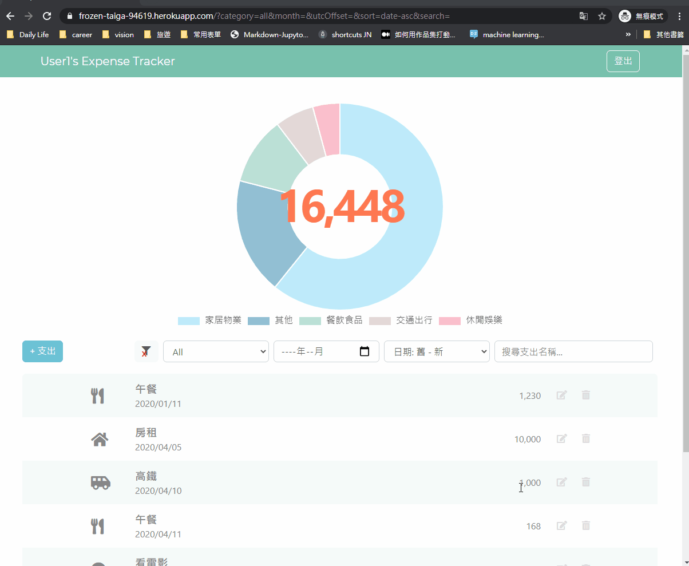

#  💸Expense Tracker
Expense tracker built by Express.js and Mongoose. Track your everyday expense at ease.

Website: https://frozen-taiga-94619.herokuapp.com

### Testing Account

**user1:**

* Email: user1@example.com
* Password: 12345678

**user2:**

* Email: user2@example.com

* Password: 12345678

  

## Features
* Register and login with email or facebook account
* Record, edit, and delete expense
* Quickly check category subtotals with pie chart
* Filter, search, and sort expense trackers simultaneously:
  * filter by category, year and month simultaneously
  * search by expense name
  * sort by amount or date
* Timezone difference issue is managed , and all date is shown in local time

## UX Features

* Clear all filter and sort conditions by clicking on the funnel button
* Hover over the category icon to see category name on tooltips

## Tech Stack
* [Express](https://expressjs.com/en/api.html)
* [Node.js](https://nodejs.org/en/docs/)
* [MongoDB](https://docs.mongodb.com/)
### Tool I use
* [Axios](https://github.com/axios/axios)
* [Bcryptjs](https://www.npmjs.com/package/bcryptjs)
* [Chart.js](https://www.chartjs.org/)
* [Express-handlebars](https://www.npmjs.com/package/express-handlebars)
* [Mongoose](https://mongoosejs.com/docs/documents.html)
* [Passport](http://www.passportjs.org/docs/)

## Installation
1. Enter ` git clone https://github.com/Kaikai8888/expense-tracker.git ` in the terminal to download the project folder
2. Enter `npm install` in the terminal to install packages
3. Use [Robo 3T](https://robomongo.org/) to manipulate mongoDB, create connection to `localhost: 27017`, and create the database,`expense-tracker`
4. Follow `.env.example` to create `.env` file to set up environmental variables
5. Enter `npm run seed` in the terminal to to run seeder.js with nodemon and create seed data
6. Enter `npm run dev` in the terminal to run app.js with Nodemon to set up database connection and start local server 
7. Enter http://localhost:3000 in the browser to enter the website

